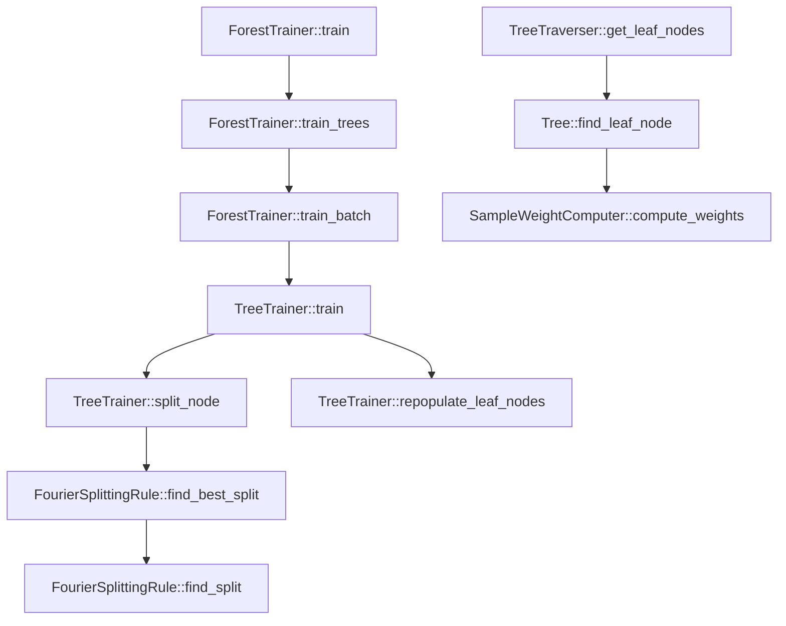

# Algorithm 1 mapped to the C++ implementation

## Scope

Python and R mainly prepare inputs and call the compiled library. The actual
forest construction, node splitting, honest leaf population, tree traversal,
and weight calculation are implemented in C++.

This document gives a concise mapping of all 40 pseudocode lines to that C++
implementation. It follows the default Fourier-MMD splitting path.

## Main C++ path

| C++ component | Main responsibility |
|---|---|
| [`ForestTrainer`](../core/src/forest/ForestTrainer.cpp#L38-L150) | Build all trees, manage subsampling, batching, threads, and CI groups. |
| [`TreeTrainer`](../core/src/tree/TreeTrainer.cpp#L33-L227) | Build one tree, process nodes, create children, and implement honesty. |
| [`RandomSampler`](../core/src/sampling/RandomSampler.cpp#L28-L143) | Draw samples without replacement and split honest samples. |
| [`FourierSplittingRule`](../core/src/splitting/FourierSplittingRule.cpp#L76-L491) | Compute random Fourier features and select the best MMD split. |
| [`Tree`](../core/src/tree/Tree.cpp#L69-L168) | Store tree structure and route observations to leaves. |
| [`SampleWeightComputer`](../core/src/prediction/collector/SampleWeightComputer.cpp#L24-L77) | Accumulate and normalize training-sample weights. |

## Forest construction: pseudocode lines 1-10

| Line | Pseudocode meaning | C++ correspondence |
|---:|---|---|
| 1 | Start `BUILDFOREST(samples, N)` | [`ForestTrainer::train`](../core/src/forest/ForestTrainer.cpp#L38-L45) receives the combined data and forest options. |
| 2 | Loop over `N` trees | `train_trees`, `train_batch`, and optionally `train_ci_group` distribute tree construction across batches and threads. |
| 3 | Draw a tree subsample | `train_tree` calls `RandomSampler::sample_clusters`; ordinary sampling shuffles IDs and truncates the vector, so it is without replacement. |
| 4 | Split into build and populate samples | `TreeTrainer::train` calls the two-output `sampler.subsample(...)`, producing disjoint `tree_growing_clusters` and `new_leaf_clusters`. |
| 5 | Create a new tree | `TreeTrainer::train` initializes parallel arrays for children, node samples, split variables, and split values, then creates root index `0`. |
| 6 | Build from the root | A `while (num_open_nodes > 0)` loop processes root `0` and every subsequently appended child. The implementation is iterative, not recursive. |
| 7 | Populate honest leaves | After the split structure is complete, `repopulate_leaf_nodes` routes populate-sample observations through the tree and replaces the build-sample leaf contents. |
| 8 | End the tree loop | The completed `unique_ptr<Tree>` is moved into the vector owned by the current batch or CI group. |
| 9 | Return all trees | `ForestTrainer::train` wraps the completed tree vector in a `Forest`. |
| 10 | End `BUILDFOREST` | The `Forest` returns to the Rcpp binding for serialization. |

## Building one tree: pseudocode lines 11-30

| Line | Pseudocode meaning | C++ correspondence |
|---:|---|---|
| 11 | Start `BUILDTREE(current_node)` | The work is divided among `TreeTrainer::train`, `split_node`, and `split_node_internal`. A node is an integer index into parallel vectors. |
| 12 | Check stopping criteria | `split_node_internal` stops when the node size is at most `min_node_size`, relabeling requests a stop, or no positive split is found. |
| 13 | Return for a terminal node | A terminal node returns `true`; the outer loop decreases `num_open_nodes` and creates no children. |
| 14 | End stopping block | This is represented by the early boolean return from `split_node_internal`. |
| 15 | Get samples in the node | The current observations are stored directly in `samples[node]`. |
| 16 | Select candidate variables | `create_split_variable_subset` draws `Poisson(mtry)`, clamps it to `[1, p]`, and samples that many distinct predictor columns. |
| 17 | Initialize candidate storage | `FourierSplittingRule::find_best_split` initializes only `best_var`, `best_value`, and `best_decrease`; it does not store every candidate. |
| 18 | Loop over variables and split levels | `find_best_split` loops over candidate variables. `find_split` sorts node observations by predictor rank and scans every boundary between distinct values. |
| 19 | Form left and right candidates | Candidate child vectors are not constructed. Prefix Fourier sums provide left/right counts and feature means. Only the winning children are materialized later. |
| 20 | Compute the splitting statistic | For each node, `find_best_split` computes features `exp(i * omega^T y)`. `find_split` compares left and right feature means using the scaled approximate MMD score. |
| 21 | Add the candidate | The code updates best-so-far values immediately rather than appending a candidate object to a collection. |
| 22 | End candidate loops | The variable loop and sorted-boundary scan finish after every allowed candidate has been scored. |
| 23 | Select the best split | The online maximum is already available. If `best_decrease <= 0`, the node becomes a leaf; otherwise the selected variable and threshold are stored. |
| 24 | Create the left node | `split_node` appends a node and sends observations satisfying `X <= split_value` to it. |
| 25 | Create the right node | A second node is appended and receives observations satisfying `X > split_value`. |
| 26 | Build both children | No recursive calls occur. Appending the children increases the open-node count, and the outer loop processes them later. |
| 27 | Store child links | Left and right indices are written to `child_nodes[0][node]` and `child_nodes[1][node]`. |
| 28 | Store the split | The Fourier rule writes `split_vars[node]` and `split_values[node]`. |
| 29 | Return from the node | `split_node` returns `false` after a successful split; the outer loop advances to the next node index. |
| 30 | End `BUILDTREE` | When `num_open_nodes` reaches zero, `TreeTrainer::train` constructs the final `Tree(0, ...)`. |

## Computing forest weights: pseudocode lines 31-40

| Line | Pseudocode meaning | C++ correspondence |
|---:|---|---|
| 31 | Start `GETWEIGHTS(forest, x)` | The Rcpp prediction binding invokes `TreeTraverser` and `SampleWeightComputer` for every test observation. |
| 32 | Initialize `w = 0` | `SampleWeightComputer::compute_weights` starts with an empty `unordered_map`; absent training indices represent zero weights. |
| 33 | Loop over trees | `compute_weights` iterates over the requested tree range and skips trees invalid for OOB prediction. |
| 34 | Find the leaf containing `x` | `TreeTraverser` obtains leaf IDs. `Tree::find_leaf_node` starts at root `0` and follows the stored `<=` left / `>` right rules. |
| 35 | Loop over leaf members | `add_sample_weights` iterates over the training-sample IDs stored in the reached leaf. |
| 36 | Add `1 / (leaf_size * forest_size)` | C++ first adds `1 / leaf_size` for each contributing tree, then normalizes the complete map after the tree loop. With all trees contributing, this is algebraically identical to the pseudocode. |
| 37 | End leaf-member loop | `add_sample_weights` returns after updating every sample in the leaf. |
| 38 | End tree loop | The map now contains the sum of all valid per-tree leaf distributions. |
| 39 | Return `w` | `normalize_sample_weights` divides every accumulated value by total mass, and `compute_weights` returns the normalized sparse map. |
| 40 | End `GETWEIGHTS` | Rcpp places the maps into a sparse matrix returned to R and then Python. |

## Important implementation differences

- Tree construction is iterative through an open-node loop rather than
  recursive calls.
- Split candidates are evaluated online; the implementation stores only the
  current best candidate.
- Candidate child sets are represented by counts and prefix Fourier sums until
  the winning split is known.
- Random Fourier features are computed inside `find_best_split`, so they are
  recomputed for every splittable node.
- The paper divides by the forest size inside the weight loop; C++ instead adds
  per-leaf weights and normalizes once after processing the trees.