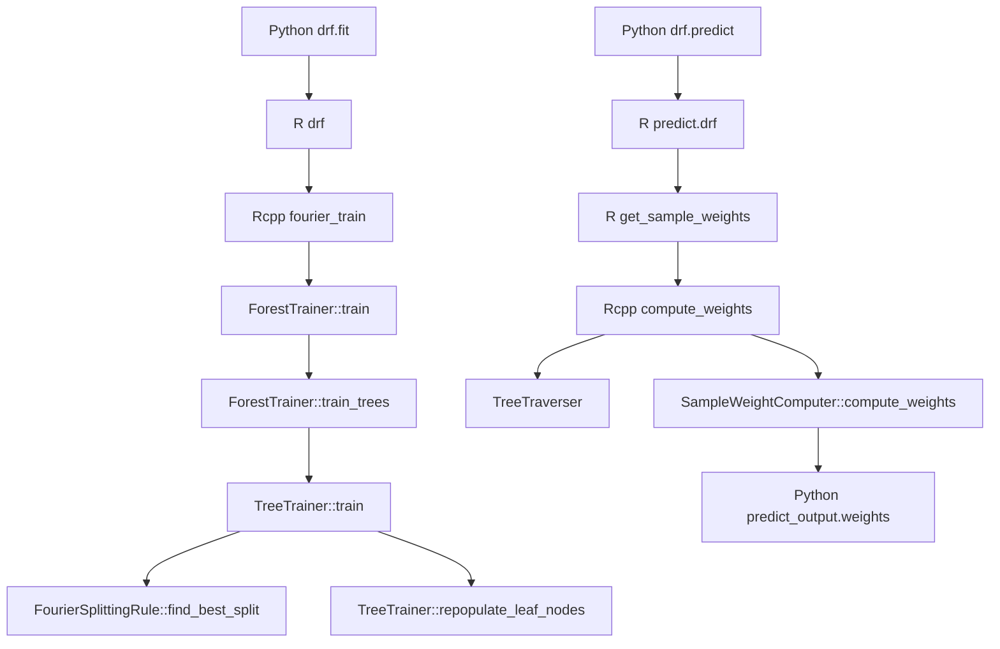

# Algorithm 1 to implementation mapping

## Purpose and scope

This document maps every numbered line of **Algorithm 1, "Pseudocode for
Distributional Random Forest,"** in Appendix A of `21-0585 (1).txt` to the
checked-in implementation in this repository.

The most important fact is that the Python package is **not a Python
implementation of Algorithm 1**. It is a thin `rpy2` adapter around the R
package. The R package performs input preparation and calls the C++ core through
Rcpp. Consequently, an exact correspondence has to cross three language layers:

1. **Python API layer**: converts Python inputs, invokes R, and exposes returned
   weights and derived functionals.
2. **R orchestration layer**: validates and transforms data, establishes
   defaults, chooses the splitting rule, and calls Rcpp.
3. **C++ algorithm layer**: samples observations, builds trees, evaluates
   Fourier-MMD splits, repopulates honest leaves, traverses trees, and computes
   forest weights.

Unless stated otherwise, this document follows the default
`splitting.rule = "FourierMMD"` path. The mapping is a static audit of the
sources in this checkout; it does not assume that an independently installed R
package has exactly the same revision.

## End-to-end call path



The key entry points are:

| Layer | Entry point | Responsibility |
|---|---|---|
| Python | [`drf.fit`](drf/code.py#L67-L76) | Convert `X` and `Y` to data frames, convert them to R objects, and call R `drf`. |
| R | [`drf`](../r-package/drf/R/drf.R#L109-L240) | Validate/encode inputs, scale `Y` for splitting, choose bandwidth/defaults, and call `fourier_train`. |
| Rcpp | [`fourier_train`](../r-package/drf/bindings/RegressionForestBindings.cpp#L89-L147) | Build C++ data/options objects, obtain a Fourier trainer, and call `ForestTrainer::train`. |
| C++ | [`ForestTrainer`](../core/src/forest/ForestTrainer.cpp#L38-L150) | Coordinate all trees, subsampling, batching, and optional confidence-interval groups. |
| C++ | [`TreeTrainer`](../core/src/tree/TreeTrainer.cpp#L33-L227) | Split the honest sample, build one tree, create child nodes, and repopulate leaves. |
| C++ | [`FourierSplittingRule`](../core/src/splitting/FourierSplittingRule.cpp#L78-L491) | Construct random Fourier features and find the highest-scoring split. |
| Python/R/C++ | prediction chain | Invoke `predict.drf`, traverse each tree, collect leaf members, and normalize their weights. |

## A note on names at the Python/R boundary

The Python source calls:

```python
self.r_fit_object = drf_r_package.drf(X_r, Y_r, **self.fit_params)
r_output = drf_r_package.predict_drf(self.r_fit_object, newdata_r)
```

The first name is the R function `drf`. The second is how `rpy2` exposes the R
S3 function `predict.drf`: the period is translated to an underscore. It is not
a separate Python or R function named `predict_drf` in this repository.

---

# Procedure 1: forest construction (Algorithm lines 1-10)

## Line 1: enter `BUILDFOREST(samples, number_of_trees)`

### Python correspondence

The closest Python procedure is [`drf.fit`](drf/code.py#L67-L76):

- `convert_to_df(X)` and `convert_to_df(Y)` normalize accepted Python inputs.
- `self.X_train` and `self.Y_train` retain the Python-side training data.
- `ro.conversion.py2rpy` converts the two data frames into R objects.
- `drf_r_package.drf(X_r, Y_r, **self.fit_params)` transfers control to R.

The Python method does not create a sample set, loop over trees, or construct a
tree itself.

### R correspondence

R [`drf`](../r-package/drf/R/drf.R#L109-L240) is the orchestration counterpart:

- `X` corresponds to the predictors \(x_i\).
- `Y` corresponds to the responses \(y_i\).
- `NROW(X)` is the training size \(n\).
- `num.trees` corresponds to the requested \(N\).
- `create_data_matrices` combines predictors, transformed outcomes, and optional
  sample weights into the representation consumed by C++.
- `fourier_train` is selected when `splitting.rule == "FourierMMD"`.

### C++ correspondence

Rcpp [`fourier_train`](../r-package/drf/bindings/RegressionForestBindings.cpp#L89-L147)
constructs a `ForestTrainer` using `fourier_trainer(...)`, builds
`ForestOptions`, and calls `trainer.train(data, options)`. The actual C++ forest
procedure begins at [`ForestTrainer::train`](../core/src/forest/ForestTrainer.cpp#L38-L45).

### Exactness note

There is no one function named `BUILDFOREST` in the code. Its responsibilities
are split across Python `fit`, R `drf`, Rcpp `fourier_train`, and C++
`ForestTrainer::train`.

## Line 2: repeat for trees `1, ..., N`

The literal serial `for` loop in the pseudocode is implemented as batched and
potentially parallel C++ work:

- [`ForestTrainer::train_trees`](../core/src/forest/ForestTrainer.cpp#L47-L93)
  validates sample sizes, computes the number of batches, and launches
  `train_batch` jobs through a thread pool.
- [`ForestTrainer::train_batch`](../core/src/forest/ForestTrainer.cpp#L97-L122)
  repeatedly trains trees until its assigned batch size is reached.
- With `ci.group.size > 1`,
  [`train_ci_group`](../core/src/forest/ForestTrainer.cpp#L133-L150) contains an
  inner loop that creates all trees in one confidence-interval group.

Thus, the semantic operation "build \(N\) trees" is present, but tree order is
organized by batches and CI groups rather than one top-level serial loop.
The exact number returned can differ from the requested \(N\) because of the
CI-group arithmetic described under Exactness Caveat 4.

## Line 3: draw a subsample for the current tree

### Controlling parameters

Python passes arbitrary `fit_params` unchanged. R supplies the default
`sample.fraction = 0.5` and includes it in the `args` passed to C++.

### C++ implementation

For the ordinary one-tree route,
[`ForestTrainer::train_tree`](../core/src/forest/ForestTrainer.cpp#L125-L130)
calls `sampler.sample_clusters(...)`, then passes the sampled clusters to
`TreeTrainer::train`.

[`RandomSampler::sample`](../core/src/sampling/RandomSampler.cpp#L28-L53) uses
the unweighted path when no sample weights are supplied.
[`shuffle_and_split`](../core/src/sampling/RandomSampler.cpp#L134-L143) shuffles
the available IDs and truncates the shuffled vector. This is sampling **without
replacement**, as required by the paper, not bootstrap sampling with
replacement.

### CI-group qualification

The checked-in R default is `ci.group.size = as.integer(num.trees / 30)`, so the
default path usually calls
[`train_ci_group`](../core/src/forest/ForestTrainer.cpp#L133-L150). In that path:

1. one initial cluster subsample is drawn for the whole group;
2. each tree calls `TreeTrainer::train` using that shared group subsample; and
3. `TreeTrainer` may then draw its tree-growing sample from the group sample.

Therefore, the paper's conceptual "fresh subsample for each tree" is not a
literal description of the default grouped implementation: trees in a CI group
share the first subsample.

## Line 4: split the subsample into build and populate sets (honesty)

### R defaults

R sets `honesty = TRUE` and `honesty.fraction = 0.5`. Python has no independent
honesty defaults; it inherits these values unless the caller supplies keyword
arguments.

### C++ implementation

In [`TreeTrainer::train`](../core/src/tree/TreeTrainer.cpp#L46-L55):

- `tree_growing_clusters` represents the paper's build set;
- `new_leaf_clusters` represents the paper's populate/estimation set;
- `sampler.subsample(..., honesty_fraction, tree_growing_clusters,
  new_leaf_clusters)` divides one sample into two disjoint parts.

The two-output
[`RandomSampler::subsample`](../core/src/sampling/RandomSampler.cpp#L69-L85)
shuffles the IDs once, assigns the first portion to one output, and assigns the
remaining IDs to the other output. No observation can occur in both outputs.

The cluster IDs are expanded into actual observation IDs through
`sampler.sample_from_clusters(...)`, which fills `nodes[0]` with build
observations and `new_leaf_samples` with populate observations. In the default
non-clustered configuration, `sample_from_clusters` simply copies the supplied
IDs.

## Line 5: create a new tree from the build set

There is no early `Tree` allocation exactly where the pseudocode places
`CREATENEWTREE`.

Instead, [`TreeTrainer::train`](../core/src/tree/TreeTrainer.cpp#L38-L60):

- allocates parallel arrays for child IDs, leaf samples, split variables, and
  split values;
- creates root node index `0` by appending the first entries to those arrays;
- stores all `tree_growing_samples` in `nodes[0]`; and
- initializes bookkeeping with one open node.

The concrete `Tree` object is constructed only after all nodes have been
processed. Therefore, line 5 corresponds to initialization of the arrays that
will become a tree, not to an immediate `Tree(...)` object construction.

## Line 6: build the tree starting at its root

Root node `0` is processed by the loop in
[`TreeTrainer::train`](../core/src/tree/TreeTrainer.cpp#L62-L83).

The paper describes recursive depth-first calls. The implementation is
iterative:

- `i` is the current node index;
- `num_open_nodes` records how many appended nodes still need processing;
- `split_node(...)` either marks `i` as terminal or appends two children; and
- incrementing `i` eventually processes those children.

Because child nodes are appended to arrays and visited later, this is effectively
a breadth-first/index-order construction rather than literal recursion. It is
semantically equivalent for the resulting binary tree.

## Line 7: populate the completed tree's leaves with the populate set

After construction, [`TreeTrainer::train`](../core/src/tree/TreeTrainer.cpp#L87-L96)
creates the `Tree` object and, when honesty is enabled, calls
`repopulate_leaf_nodes(tree, data, new_leaf_samples, ...)`.

[`TreeTrainer::repopulate_leaf_nodes`](../core/src/tree/TreeTrainer.cpp#L109-L125):

1. creates empty sample vectors for all nodes;
2. routes each populate-set observation through the completed split structure by
   calling `tree->find_leaf_node(data, sample)`;
3. appends that observation ID only to the reached leaf;
4. replaces the tree's existing leaf sample arrays with these honest samples;
5. optionally calls `honesty_prune_leaves` to remove empty branches.

This replacement is essential: build-set observations determine split geometry,
but, under honesty, they are not the observations later used to form the DRF
weight distribution.

## Line 8: finish the current tree iteration

There is no Python or R statement corresponding to this loop delimiter. In C++,
it is the end of one iteration in `train_batch` or the inner loop in
`train_ci_group`. The completed `unique_ptr<Tree>` is moved into the batch's
`trees` vector.

## Line 9: return the forest of all trees

[`ForestTrainer::train`](../core/src/forest/ForestTrainer.cpp#L38-L45) receives
the vector returned by `train_trees` and returns a `Forest` containing those
trees plus metadata.

The Rcpp utilities serialize each tree's root, child arrays, leaf samples, split
variables, split values, drawn samples, and related metadata into an R list. R
adds class and training metadata. Finally, Python stores the entire returned R
object in `self.r_fit_object`.

Python therefore holds an R proxy for the serialized C++ forest; it does not
hold a native Python list of Python tree objects.

## Line 10: leave `BUILDFOREST`

This conceptual endpoint spans returns from:

1. C++ `ForestTrainer::train`;
2. Rcpp `fourier_train`;
3. R `drf`; and
4. Python `drf.fit` after assigning `self.r_fit_object`.

Python `fit` has no explicit return statement, so its Python return value is
`None`; the trained forest is retained by mutation of the estimator object.

---

# Procedure 2: build one tree (Algorithm lines 11-30)

## Line 11: enter `BUILDTREE(current_node)`

No same-named recursive function exists. Its work is divided between:

- the open-node loop in
  [`TreeTrainer::train`](../core/src/tree/TreeTrainer.cpp#L62-L83);
- [`TreeTrainer::split_node`](../core/src/tree/TreeTrainer.cpp#L144-L195); and
- [`TreeTrainer::split_node_internal`](../core/src/tree/TreeTrainer.cpp#L197-L227).

The current pseudocode node is represented by an integer `node`/`i` indexing
parallel vectors. Its current observation set is `samples[node]`.

## Line 12: evaluate the stopping criterion

The implementation has three effective stopping routes in
[`split_node_internal`](../core/src/tree/TreeTrainer.cpp#L197-L227):

1. **Node-size stop**: a node is terminal when its sample count is less than or
   equal to `min_node_size`.
2. **Relabeling stop**: the generic trainer permits `relabel(...)` to report that
  splitting cannot proceed. On the default Fourier path,
  `NoopRelabelingStrategy::relabel` copies each node observation's transformed
  outcome into `responses_by_sample` and always returns `false`, so this stop
  route is not taken by Fourier DRF.
3. **No useful split stop**: `find_best_split(...)` returns `true` when no split
   with positive improvement is available.

The order differs slightly from the pseudocode. The implementation samples the
candidate variable subset in `split_node` before entering
`split_node_internal`, so candidate selection can happen even for a node that is
immediately stopped for size.

## Line 13: return if the node is terminal

The implementation represents terminal status with a boolean rather than a
recursive `return`:

- `split_node_internal` returns `true` for a leaf;
- `split_node` propagates that value;
- the outer open-node loop decrements `num_open_nodes` for a terminal node; and
- iteration proceeds to the next node index.

No children are appended and the default child IDs remain zero, the convention
used by `Tree` to recognize a leaf.

## Line 14: close the stopping block

This is only a pseudocode delimiter. In C++, the corresponding control boundary
is the early boolean return from `split_node_internal` and the `if (is_leaf_node)`
branch in the open-node loop.

## Line 15: obtain the observations belonging to the current node

The exact object is `samples[node]`, passed into `split_node` from the open-node
loop.

- Root membership is initialized from `tree_growing_samples`.
- Winning left/right memberships are appended when a split is materialized.
- After a successful split, `samples[node].clear()` releases the internal
  node's membership vector because only leaves need retain observation IDs.

Thus, `GETSAMPLES(node)` is direct vector indexing rather than a function call.

## Line 16: choose the random subset of candidate predictor variables

[`TreeTrainer::create_split_variable_subset`](../core/src/tree/TreeTrainer.cpp#L128-L141)
implements the paper's randomized `mtry` rule:

1. draw an integer from `Poisson(mtry)`;
2. clamp it to at least `1`;
3. clamp it to at most the number of usable predictor variables;
4. draw that many distinct predictor IDs.

The distinct variable draw is implemented by `RandomSampler` without
replacement. Outcome columns and other disallowed columns are excluded through
`data.get_disallowed_split_variables()`.

Although one nearby comment says "for this tree," this function is called by
`split_node`, so a fresh subset is selected for each processed node.

For categorical predictor data frames, R computes the default `mtry` from
`ncol(X)`, the number of original columns, while C++ clamps and samples against
the dummy-expanded predictor count. The Poisson mean and the final available
column count can therefore refer to different notions of \(p\).

## Line 17: initialize storage for candidate splits

There is no collection corresponding literally to `C = INITIALIZESPLITS()`.

[`FourierSplittingRule::find_best_split`](../core/src/splitting/FourierSplittingRule.cpp#L160-L220)
initializes scalar best-so-far state:

- `best_var`;
- `best_value`; and
- `best_decrease`.

Candidate child sets and a list of all candidate records are never retained.
Each candidate is evaluated, compared, and discarded unless it improves the
current maximum. This is memory-equivalent to the pseudocode's candidate
container for the purpose of selecting only the maximum.

## Line 18: iterate over candidate variables and split levels

This line has two nested implementation levels.

### Candidate-variable loop

`find_best_split` iterates over `possible_split_vars` and invokes the split
search for each selected predictor.

### Candidate-threshold loop

The data layer precomputes global unique-value ranks for predictor columns.
Within the current node, the Fourier splitting code:

1. builds `(global_rank, node_position)` pairs for that variable;
2. sorts those pairs by predictor rank;
3. scans the sorted observations from left to right;
4. considers a boundary only when adjacent predictor values differ; and
5. uses the lower observation's predictor value as the threshold.

This is the optimized equivalent of trying all distinct split levels. Repeated
predictor values are never separated, preserving the rule
\(x_{i,j} \leq l\) versus \(x_{i,j} > l\). A midpoint is unnecessary because
there is no observed predictor value strictly between this lower value and the
next distinct value.

## Line 19: derive left and right child samples for a candidate

The implementation deliberately does **not** allocate two observation vectors
for every candidate threshold.

Instead, the sorted scan maintains prefix sums of Fourier features. At a
candidate boundary:

- the prefix count is \(n_L\);
- the remaining count is \(n_R\);
- prefix feature sums determine the left feature mean; and
- total-minus-prefix sums determine the right feature mean.

Only after the best variable and threshold have been selected does
[`TreeTrainer::split_node`](../core/src/tree/TreeTrainer.cpp#L172-L192) make one
pass through `samples[node]` and materialize the winning children using
`data.get(sample, split_var) <= split_value` for the left child and the
complement for the right child.

## Line 20: compute the two-sample splitting statistic

### Selecting the criterion

R chooses `fourier_train` for `splitting.rule = "FourierMMD"`.
`fourier_trainer` installs a `FourierSplittingRuleFactory`, which creates a
`FourierSplittingRule` for tree training.

The only accepted R values are `"FourierMMD"` and `"CART"`; any other value
raises `"splitting rule not available."` The paper's observation that the
algorithm could use any kernel or two-sample test is an extensibility statement,
not an option exposed by this package revision.

### Feature construction

For a response vector \(y\) and sampled frequency \(\omega_b\), the code builds
the real and imaginary parts of

$$
\exp(i\omega_b^T y)
= \cos(\omega_b^T y) + i\sin(\omega_b^T y).
$$

The R layer globally scales response columns before creating the C++ data
matrix when `response.scaling = TRUE`. The unscaled response is retained in
`Y.orig` and is used for the returned conditional distribution.

### Candidate score

For each candidate split, the code compares left and right means of every
Fourier feature. Conceptually it evaluates

$$
v = \frac{n_L n_R}{n_P}
    \frac{1}{B}
    \sum_{b=1}^{B}
    \left|\bar\phi_{b,L}-\bar\phi_{b,R}\right|^2,
$$

the scaled approximate MMD statistic described by the paper. The complex norm
is implemented as the sum of squared real-part and imaginary-part differences.

### Optimization

Because feature sums are updated incrementally in sorted predictor order, each
candidate does not require recomputing an MMD kernel matrix or explicitly
forming both child data sets. This is the implementation of the paper's
\(O(Bn_P)\) per-variable scan.

## Line 21: add the candidate to the candidate set

There is no `ADDNEWSPLITCANDIDATE` function and no candidate object.

The Fourier rule uses online maximum tracking:

1. compare the current score with the best score for the current variable;
2. retain the candidate boundary if it is larger;
3. compare that variable's best candidate with `best_decrease`; and
4. update the node-wide best variable and threshold when appropriate.

The pseudocode stores \((v,L,R,j,l)\); the implementation stores only the best
\((v,j,l)\), then reconstructs \((L,R)\) once at lines 24-25.

## Line 22: finish scanning all candidate variables and levels

This is represented by the ends of the threshold scan and
`possible_split_vars` loop in `FourierSplittingRule::find_best_split`. Scoring,
candidate insertion, and best selection are fused into those loops.

## Line 23: find the best candidate split

No second pass over a candidate container is necessary because line 21's online
tracking has already found the maximum.

At the end of `find_best_split`:

- if `best_decrease <= 0`, the function reports that the node is terminal;
- otherwise it writes the winning predictor into `split_vars[node]`; and
- it writes the winning threshold into `split_values[node]`.

The winning child memberships are then materialized by `split_node`.

## Line 24: create the left child node

`TreeTrainer::split_node`:

1. assigns the next available node index to `child_nodes[0][node]`;
2. appends empty entries to all parallel node arrays; and
3. appends each current-node observation satisfying
   `X[sample, split_var] <= split_value` to the new left membership vector.

This new vector is the implementation's \(L_L\).

## Line 25: create the right child node

The same method:

1. assigns the following node index to `child_nodes[1][node]`;
2. appends another set of empty array entries; and
3. sends every observation not assigned left to the new right membership vector.

This new vector is the implementation's \(L_R\).

## Line 26: recursively build the two children

There are no recursive calls. Creating two children changes the open-node count
by a net `+1`: the current open node has been consumed and two new open nodes
have been appended. The outer loop later calls `split_node` for each appended
child by increasing the node index.

This iterative work-list mechanism implements the same fixed point as
`BUILDTREE(left); BUILDTREE(right)` without consuming the C++ call stack.

## Line 27: store the child links in the parent

The links are stored directly in:

- `child_nodes[0][node]` for the left child; and
- `child_nodes[1][node]` for the right child.

Unlike the pseudocode's presentation, the implementation stores these links
**before** either descendant is processed. The final topology is the same.

## Line 28: store the split variable and threshold

The Fourier rule writes the winning values directly to:

- `split_vars[node]`; and
- `split_values[node]`.

As with line 27, this occurs before child processing rather than after recursive
returns. These arrays are later serialized into the R forest object and are used
by `Tree::find_leaf_node` during prediction.

## Line 29: return from building the current node

For a successful split, `split_node` returns `false`, meaning "this was not a
leaf." The open-node loop increments the node index and continues. For a
terminal node, it returns `true`, and the open-node count is reduced.

This boolean protocol replaces the pseudocode's recursive `return`.

## Line 30: leave `BUILDTREE`

Tree building is complete when `num_open_nodes == 0`. At that point all
reachable appended nodes are terminal or have two processed children.
`TreeTrainer::train` then constructs `Tree(0, ...)`, with root index `0`, from
the completed arrays.

---

# Procedure 3: forest weights (Algorithm lines 31-40)

## Line 31: enter `GETWEIGHTS(forest, test_point)`

### Python correspondence

[`drf.predict`](drf/code.py#L90-L115):

1. converts `newdata` to a data frame;
2. converts that frame to an R object;
3. calls `drf_r_package.predict_drf(self.r_fit_object, newdata_r)`;
4. takes the first returned list member as the weight matrix; and
5. converts the R matrix through `base::as.matrix`.

The Python wrapper supports multiple test points at once, so each output matrix
row corresponds to one invocation of the paper's conceptual `GETWEIGHTS`.

### R correspondence

[`predict.drf`](../r-package/drf/R/predict.R#L198-L282) aligns/encodes test
columns, then calls `get_sample_weights`. With no R-level `functional` argument,
it returns `list(weights = w, y = object$Y.orig)`, exactly the two members the
Python wrapper reads.

[`get_sample_weights`](../r-package/drf/R/analysis_tools.R#L163-L245) constructs
training/test matrices and dispatches to Rcpp `compute_weights` (or the OOB
variant when `newdata` is absent).

### C++ correspondence

Rcpp [`compute_weights`](../r-package/drf/bindings/AnalysisToolsBindings.cpp#L96-L104)
restores the forest, traverses it for all test observations, and computes one
sparse weight row per test observation.

## Line 32: initialize a zero vector of length `n`

The implementation uses a sparse equivalent rather than allocating a dense
zero vector:

- each test point starts with an empty
  `std::unordered_map<size_t, double> weights_by_sample` in
  [`SampleWeightComputer::compute_weights`](../core/src/prediction/collector/SampleWeightComputer.cpp#L24-L31);
- absent keys are mathematically zero;
- the Rcpp binding assembles all rows into an Eigen sparse matrix; and
- Python's `base::as.matrix` call later densifies the matrix.

Therefore, the initial condition \(w_j=0\) for every training observation is
preserved without explicitly storing \(n\) zeros in C++.

## Line 33: loop over every tree

`SampleWeightComputer::compute_weights` loops from `trees.start` to
`trees.start + trees.length`.

The implementation can also receive an OOB-validity matrix. Trees marked invalid
for a particular training observation are skipped. For ordinary out-of-sample
prediction, all available trees are valid.

## Line 34: find training samples in the same leaf as the test point

This operation is split into traversal and retrieval.

### Traversal

`TreeTraverser` computes the leaf node for each test-point/tree pair.
[`Tree::find_leaf_node`](../core/src/tree/Tree.cpp#L108-L129) starts at root node
`0` and repeatedly applies the stored rule:

- go left when `value <= split_value`; and
- go right otherwise.

Traversal ends when the current node has no left child, the leaf convention used
by this tree representation.

### Retrieval

`SampleWeightComputer::compute_weights` uses the traversed leaf ID to index
`tree->get_leaf_samples()[leaf]`. Under default honesty, this vector contains
populate-set observations installed by line 7, not the build-set observations
used to choose splits.

## Line 35: loop over each training index in that leaf

[`SampleWeightComputer::add_sample_weights`](../core/src/prediction/collector/SampleWeightComputer.cpp#L59-L66)
iterates over every sample ID in the leaf vector. Each ID is an index into the
original training data, which is why the final matrix columns line up with
`Y.orig` in R and `ret.y` in Python.

## Line 36: add `1 / (leaf_size * forest_size)` to each leaf member

The implementation performs this in two algebraic stages.

First, `add_sample_weights` adds

$$
\frac{1}{|L_t(x)|}
$$

to each observation in the reached leaf for tree \(t\). After the tree loop,
`normalize_sample_weights` divides every accumulated value by the total mass.

If all \(N\) trees contribute one nonempty leaf, every tree contributes total
mass one, so the total is \(N\). The result is exactly

$$
w_j(x)
= \frac{1}{N}\sum_{t=1}^{N}
  \frac{\mathbf{1}\{j\in L_t(x)\}}{|L_t(x)|},
$$

which is the paper's update.

The staged implementation is more general than the literal pseudocode. If a
tree is invalid for OOB prediction or an unpruned honest tree has an empty leaf,
that tree is skipped and the contributions are normalized over the trees that
did contribute. In that case the denominator is the number of valid nonempty
tree contributions, not necessarily the forest's stored tree count.

## Line 37: finish the loop over leaf members

This is the end of the loop in `add_sample_weights`. The helper returns to
`compute_weights`, carrying the updated map by reference.

## Line 38: finish the loop over trees

This is the end of the tree-range loop in `compute_weights`. Empty leaf vectors
are skipped to avoid division by zero. The map now contains the unnormalized sum
of all valid per-tree leaf distributions.

## Line 39: return the weight vector

Before returning, `normalize_sample_weights`:

1. sums all map values into `total_weight`; and
2. divides every stored value by that total.

The return path is:

1. C++ returns the sparse map for one test point;
2. the Rcpp binding inserts it into a sparse matrix row;
3. R `get_sample_weights` returns the sparse matrix;
4. R `predict.drf` returns it as the first list member;
5. Python converts it to a dense matrix named `weights`; and
6. for the default `functional == "weights"`, Python assigns it to
   `predict_output.weights` and assigns the original responses to
   `predict_output.y`.

The Python-side `mean`, `sd`, `cov`, `cor`, `quantile`, and `sample` branches do
not construct Algorithm 1's weights. They are downstream plug-in calculations
using the already-computed weight matrix.

## Line 40: leave `GETWEIGHTS`

This conceptual endpoint spans returns from C++ `compute_weights`, R
`get_sample_weights`, R `predict.drf`, and Python `drf.predict`. The final Python
object is a dynamically populated `predict_output` instance.

---

# Compact line-by-line index

| Algorithm line | Primary implementation owner | Literal or transformed? |
|---:|---|---|
| 1 | Python `fit`; R `drf`; Rcpp `fourier_train`; C++ `ForestTrainer::train` | Distributed across layers |
| 2 | `ForestTrainer::train_trees`, `train_batch`, `train_ci_group` | Parallel/grouped loop |
| 3 | `RandomSampler::sample` / `sample_clusters` | Direct subsampling, with CI-group qualification |
| 4 | `TreeTrainer::train`; two-output `RandomSampler::subsample` | Direct honesty partition |
| 5 | node-array initialization in `TreeTrainer::train` | Tree object constructed later |
| 6 | open-node loop in `TreeTrainer::train` | Iterative rather than recursive |
| 7 | `TreeTrainer::repopulate_leaf_nodes` | Direct |
| 8 | batch/group loop boundary | Conceptual delimiter |
| 9 | `ForestTrainer::train`; Rcpp serialization; `self.r_fit_object` | Returned across layers |
| 10 | returns through C++, Rcpp, R, Python | Conceptual delimiter |
| 11 | `TreeTrainer::train`, `split_node`, `split_node_internal` | Distributed/iterative |
| 12 | `split_node_internal` | Multiple stopping routes |
| 13 | boolean leaf return and open-node accounting | Transformed control flow |
| 14 | early-return boundary | Conceptual delimiter |
| 15 | `samples[node]` | Direct indexing |
| 16 | `create_split_variable_subset` | Direct Poisson-and-clamp rule |
| 17 | best-so-far scalar initialization | No candidate container |
| 18 | Fourier variable loop and sorted boundary scan | Optimized direct equivalent |
| 19 | prefix counts/sums; winning partition in `split_node` | Candidate sets materialized only for winner |
| 20 | `FourierSplittingRule` | Direct approximate MMD criterion |
| 21 | online maximum updates | No stored candidate records |
| 22 | nested loop boundaries | Conceptual delimiter |
| 23 | already-computed `best_*` values | Fused with lines 20-21 |
| 24 | left child array append and membership fill | Direct |
| 25 | right child array append and membership fill | Direct |
| 26 | open-node work list | Iterative rather than recursive |
| 27 | `child_nodes[0/1][node]` | Direct, stored earlier than pseudocode |
| 28 | `split_vars[node]`, `split_values[node]` | Direct, stored earlier than pseudocode |
| 29 | boolean return from `split_node` | Transformed control flow |
| 30 | `num_open_nodes == 0`; final `Tree` construction | Conceptual endpoint |
| 31 | Python `predict`; R `predict.drf`; Rcpp `compute_weights` | Distributed across layers |
| 32 | empty `unordered_map`; sparse matrix | Sparse zero vector |
| 33 | tree-range loop in `SampleWeightComputer` | Direct |
| 34 | `TreeTraverser`; `Tree::find_leaf_node`; leaf sample indexing | Direct, split into stages |
| 35 | `add_sample_weights` loop | Direct |
| 36 | add `1/leaf_size`, then normalize | Algebraically equivalent for ordinary prediction |
| 37 | helper loop boundary | Conceptual delimiter |
| 38 | tree loop boundary | Direct delimiter plus empty-leaf handling |
| 39 | normalize, return sparse matrix, expose in Python | Distributed across layers |
| 40 | returns through C++, Rcpp, R, Python | Conceptual delimiter |

---

# Dedicated line-by-line mapping to the R code

This section repeats the 1-40 walk with a deliberately narrower question:
**what, exactly, does the R code do for this pseudocode line?** This distinction
is important because most tree operations are not written in R. R prepares
arguments and enters compiled code through generated `.Call(...)` wrappers.

The R-side training route is:

```r
data <- create_data_matrices(
  X.mat,
  outcome = Y.transformed,
  sample.weights = sample.weights
)

args <- list(
  num.trees = num.trees,
  sample.fraction = sample.fraction,
  mtry = mtry,
  min.node.size = min.node.size,
  honesty = honesty,
  honesty.fraction = honesty.fraction,
  honesty.prune.leaves = honesty.prune.leaves,
  alpha = alpha,
  num_features = num.features,
  bandwidth = bandwidth,
  ...
)

forest <- do.call.rcpp(fourier_train, c(data, args))
```

`do.call.rcpp` changes periods in R argument names to underscores and invokes
the generated wrapper. That wrapper is only:

```r
fourier_train <- function(...) {
  .Call('_drf_fourier_train', PACKAGE = 'drf', ...)
}
```

The ellipses above abbreviate the wrapper's explicit 23 formal arguments; they
do not indicate a variadic implementation. The full definitions are in
[`drf.R`](../r-package/drf/R/drf.R#L109-L251),
[`input_utilities.R`](../r-package/drf/R/input_utilities.R#L184-L190), and
[`RcppExports.R`](../r-package/drf/R/RcppExports.R#L24-L30).

## R mapping for forest construction (Algorithm lines 1-10)

| Algorithm line | Exact R correspondence | What R does, and what it delegates |
|---:|---|---|
| R-1 | [`drf <- function(X, Y, num.trees = 3000, ...)`](../r-package/drf/R/drf.R#L109-L129) | This is the R entry point corresponding to `BUILDFOREST`. R receives the sample columns as `X` and `Y`, validates them, dummy-encodes categorical predictor columns, converts `Y` to a numeric matrix, optionally scales `Y`, and combines the matrices for C++. It does not itself instantiate a forest algorithm object. |
| R-2 | Formal `num.trees`, `args$num.trees`, and generated formal `num_trees` | R represents the requested loop bound as data. `drf` places `num.trees` in `args`; `do.call.rcpp` renames it `num_trees`; generated `fourier_train` passes it to `_drf_fourier_train`. There is no `for (i in seq_len(num.trees))` in R. Batching, CI grouping, and the actual loop occur in C++. |
| R-3 | Formal `sample.fraction = 0.5` and `args$sample.fraction` | R configures the fraction used by `SUBSAMPLE` and forwards it as `sample_fraction`. It does not call R's `sample()` to form tree subsamples. The `sample()` call in `medianHeuristic` for more than 5,000 responses is only a bandwidth approximation and is unrelated to Algorithm line 3. |
| R-4 | Formals `honesty`, `honesty.fraction`, and `honesty.prune.leaves` | R defaults honesty to `TRUE`, the build fraction to `0.5`, and pruning to `TRUE`, then forwards all three values. It does not create `L_build` or `L_populate`; C++ performs that disjoint partition for each tree. |
| R-5 | No R tree-construction statement | R has no `new.env`, list constructor, or R6/reference-class operation corresponding to `CREATENEWTREE`. The forest list appears only after the compiled `fourier_train` call returns. |
| R-6 | `forest <- do.call.rcpp(fourier_train, c(data, args))` | This call delegates root creation and complete tree construction. From R's perspective it is one blocking native call; R cannot observe or intervene in the per-node build loop. |
| R-7 | Honesty arguments in `args`; no R population loop | R determines whether compiled training should repopulate leaves by forwarding `honesty` and `honesty.prune.leaves`. It never routes populate-set rows through a tree in R. The returned `_leaf_samples` arrays already contain the post-honesty memberships. |
| R-8 | No R loop delimiter | There is no R forest loop to close. Completion of a compiled tree iteration is internal to `_drf_fourier_train`. |
| R-9 | Assignment to `forest`, metadata additions, final `forest` expression | The native result is assigned to `forest`. R gives it class `"drf"` and adds `X.orig`, unscaled `Y.orig`, factor-column metadata, tuning parameters, CI group size, sample weights, and optional variable importance. The final expression returns that enriched forest list. |
| R-10 | Final `forest` followed by `}` in `drf` | This is the R return boundary for `BUILDFOREST`. Unlike Python `fit`, which returns `None`, R `drf` returns the forest object itself. All tree building has already completed before this expression runs. |

### R preprocessing attached to line 1

The following R work changes the representation of the pseudocode's
\(\{(x_i,y_i)\}_{i=1}^n\) before native training begins:

- `validate_X` accepts numeric matrices, sparse matrices, and data frames whose
  columns are numeric, factor, or character.
- `fastDummies::dummy_cols(..., remove_selected_columns = TRUE)` replaces
  categorical predictor columns with indicators.
- `validate_Y` rejects nonnumeric outcomes, so the paper's claimed categorical
  response encoding is not implemented here.
- `Y.transformed <- scale(Y)` supplies globally standardized outcomes to the
  splitting code by default.
- `forest[["Y.orig"]] <- Y` preserves unscaled outcomes for the weighted
  conditional distribution returned during prediction.
- `create_data_matrices` appends transformed outcome columns after predictor
  columns and records their one-based `outcome.index` values for Rcpp.

## R mapping for building a tree (Algorithm lines 11-30)

For all lines in this procedure, the generated R wrapper has already entered
`_drf_fourier_train`. There is no callback from C++ into R for each node or
candidate. The R correspondences are therefore mostly configuration values or
fields received after native training.

| Algorithm line | Exact R correspondence | What R does, and what it delegates |
|---:|---|---|
| R-11 | No R `BUILDTREE` function | R exposes no recursive or iterative node-building function. The sole R-level action is the earlier `fourier_train` `.Call`, which does not return until every tree is complete. |
| R-12 | Formal `min.node.size = 15`; forwarded `min_node_size` | R configures one stopping input. It does not evaluate node size, relabel outcomes, or decide whether a positive split exists. `alpha` is also forwarded, but it is intended for candidate child balance rather than the top-level node-size stop. |
| R-13 | No per-node R `return` | R receives no terminal-node signal. The C++ boolean return used to mark a leaf remains entirely below the `.Call` boundary. |
| R-14 | No R block delimiter | There is no R `if` statement corresponding to the stopping block. Input validation in `drf` is outside the tree recursion and must not be confused with this algorithm line. |
| R-15 | `data <- create_data_matrices(X.mat, outcome = Y.transformed, ...)` | R supplies all rows to native code in one matrix and records outcome-column positions. It does not maintain node-specific row-index vectors or implement `GETSAMPLES(node)`. |
| R-16 | Formal `mtry = min(ceiling(sqrt(ncol(X)) + 20), ncol(X))`; `args$mtry` | R computes and forwards the Poisson mean parameter. It does not draw `Poisson(mtry)` or select variables. For categorical data, this default uses the original `ncol(X)`, while C++ samples among dummy-expanded columns. |
| R-17 | No R candidate container | No R `list`, data frame, or vector is initialized for split candidates. Best-candidate state is native C++ state. |
| R-18 | No R candidate-variable or level loop | R does not sort node values or iterate over thresholds. The matrix passed through Rcpp is the only R object involved. |
| R-19 | No R child-sample construction | R does not subset rows into left and right candidates. Candidate feature sums and the final winning partition are computed in C++. |
| R-20 | `splitting.rule`, `response.scaling`, `num.features`, `bandwidth`, and `node.scaling` | This is the tree-building line with the largest R role. R chooses `fourier_train` versus `gini_train`; globally scales `Y` by default; computes a default bandwidth; forwards the random-feature count; and converts the logical node-scaling switch to `0` or `1`. The Fourier features and MMD score are still evaluated only in C++. |
| R-21 | No R candidate insertion | R has no equivalent of `ADDNEWSPLITCANDIDATE`; it receives no candidate scores from native code. |
| R-22 | No R loop delimiter | Both native loops finish before `.Call` returns. |
| R-23 | No R best-split search | R does not call `which.max`, `order`, or a similar operation. The selected split is later visible only indirectly through serialized `_split_vars` and `_split_values`. |
| R-24 | Returned `forest[["_child_nodes"]]` and `forest[["_leaf_samples"]]` | R does not create the left node. Once native training returns, the serialized forest list contains the completed left-child index and memberships inside the tree arrays. |
| R-25 | Same returned child/leaf arrays as line 24 | R does not create the right node either. Left and right child vectors are two components of the native serialized `_child_nodes` representation. |
| R-26 | No R recursion | R performs neither `Recall()` nor calls to an R tree function. Both child builds occur in the C++ open-node loop. |
| R-27 | Returned `forest[["_child_nodes"]]` | The child links are observable in R after training, but R only stores the already-serialized arrays; it did not assign the links during construction. |
| R-28 | Returned `forest[["_split_vars"]]` and `forest[["_split_values"]]` | The selected variable and threshold for every internal node are observable as private-style list members after `.Call` returns. R adds class/metadata but does not alter these arrays. |
| R-29 | No per-node R return | The native node routine returns internally. R remains blocked in `.Call` and receives only the completed forest. |
| R-30 | Return from generated `fourier_train`, then continuation in `drf` | This is the nearest R-visible endpoint: `.Call('_drf_fourier_train', ...)` finally returns an R list after all native open-node loops and honest repopulation have finished. R then assigns class and metadata. |

### R configuration attached to line 20

The exact default bandwidth route is:

```r
Y.transformed <- scale(Y)
bandwidth <- sqrt(medianHeuristic(Y.transformed))

medianHeuristic <- function(Y) {
  stats::median(sqrt(stats::dist(Y) / 2))
}
```

Thus R computes the bandwidth once per forest, not once per node. R also exposes
only two splitting-rule strings:

- `"FourierMMD"` calls generated R wrapper `fourier_train`;
- `"CART"` calls generated R wrapper `gini_train`; and
- every other value stops with `"splitting rule not available."`

## R mapping for forest weights (Algorithm lines 31-40)

The R prediction route is:

```r
w <- get_sample_weights(
  forest = object,
  newdata = newdata.mat,
  num.threads = num.threads,
  estimate.uncertainty = FALSE
)

return(list(weights = w, y = object$Y.orig))
```

`get_sample_weights` rebuilds predictor matrices and calls generated R wrapper
`compute_weights`, whose body is a `.Call('_drf_compute_weights', ...)`. See
[`predict.R`](../r-package/drf/R/predict.R#L198-L288),
[`analysis_tools.R`](../r-package/drf/R/analysis_tools.R#L212-L245), and
[`RcppExports.R`](../r-package/drf/R/RcppExports.R#L8-L18).

| Algorithm line | Exact R correspondence | What R does, and what it delegates |
|---:|---|---|
| R-31 | `predict.drf`, then `get_sample_weights` | `predict.drf` is the R entry point corresponding to `GETWEIGHTS`. It validates and dummy-aligns `newdata`, preserves training column order, and invokes `get_sample_weights`. Python's `predict_drf` attribute is `rpy2`'s translated name for this R S3 function. |
| R-32 | No R `numeric(n)`; generated `compute_weights` call | R does not initialize the conceptual zero vector. `get_sample_weights` calls native `compute_weights`, which returns an Eigen sparse matrix. Structural zeros in that sparse result represent the pseudocode's untouched zero entries. |
| R-33 | No R tree loop | The full forest object is passed once to `.Call('_drf_compute_weights', ...)`. Iteration over trees is native. R's `apply(w, 1, ...)` calls elsewhere operate on completed weight rows for functionals and are not the Algorithm line 33 loop. |
| R-34 | No R leaf traversal | R passes the encoded test matrix and serialized forest to C++. It does not inspect `_split_vars` or `_child_nodes` during ordinary prediction. The reached leaf and its sample IDs are determined natively. |
| R-35 | No R loop over leaf IDs | R receives only the completed sparse row. It does not loop over `_leaf_samples` to construct ordinary weights. |
| R-36 | No R weight increment | The `1 / |L|` additions and final normalization happen in C++. R neither divides by leaf size nor by tree count in `get_sample_weights`. |
| R-37 | No R leaf-loop delimiter | This loop exists only inside native `SampleWeightComputer::add_sample_weights`. |
| R-38 | No R tree-loop delimiter | Native `SampleWeightComputer::compute_weights` finishes the tree loop before generated `compute_weights` returns. |
| R-39 | Native matrix return, then `return(list(weights = w, y = object$Y.orig))` | The generated wrapper returns a sparse matrix to `get_sample_weights`; that function returns it to `predict.drf`; and `predict.drf` places it in the named `weights` list member. The adjacent `y` member is the original, unscaled training response matrix. Python reads these as `r_output[0]` and `r_output[1]`. |
| R-40 | Return from `predict.drf` | This is the R endpoint of `GETWEIGHTS`. For the Python wrapper's call, `functional` is `NULL`, so R returns the weights and original responses without computing an R-side mean, quantile, or other functional. |

### Ordinary versus OOB R prediction

When `newdata` is non-`NULL`, `get_sample_weights` calls `compute_weights`. When
`newdata` is `NULL`, it calls `compute_weights_oob`, which excludes trees that
used the target training observation. Python's `drf.predict` requires a
`newdata` argument and converts it before calling R, so its normal path is the
first branch. This is why the main line 31-40 mapping describes out-of-sample
weights, while the normalization caveat also mentions OOB behavior.

---

# Parameters and paper-to-code defaults

The prose surrounding Algorithm 1 describes defaults that do not all match this
checkout.

| Concept | Paper / Appendix A | Checked-in implementation |
|---|---|---|
| Number of trees | 2,000 | R `num.trees = 3000` |
| Tree sample fraction | 0.5 | R `sample.fraction = 0.5` |
| Honesty | Enabled | R `honesty = TRUE` |
| Build share of honest sample | One disjoint half in the described default | R `honesty.fraction = 0.5` |
| Candidate variable count | `clamp(Poisson(mtry), 1, p)` | Implemented by `create_split_variable_subset` |
| `mtry` default | Described as a tuning parameter | R `min(ceiling(sqrt(p) + 20), p)` |
| Minimum node size | Paper discusses stopping when few observations remain | R function default is `15` |
| Minimum child fraction | Prose says 10% default | R `alpha = 0.05`; see implementation caveat below |
| Fourier feature count `B` | 20 | R `num.features = 10` |
| Response scaling | Enabled for tree building | R `response.scaling = TRUE`; unscaled `Y.orig` retained |
| Gaussian bandwidth | Median heuristic | R computes it before calling C++; see caveat below |
| CI grouping | Not part of Algorithm 1 | R default `ci.group.size = as.integer(num.trees / 30)` |

The Python constructor merely stores `fit_params`; it supplies none of these
defaults itself. Therefore, omitted Python keyword arguments always inherit the
defaults of whichever R `drf` package `rpy2` imports.

The Python README's example explicitly passes `num_trees = 2000` and
`num_features` is not shown, while calling those values "the defaults." That
statement does not match the checked-in R function, whose defaults are 3,000 and
10 respectively.

---

# Exactness caveats and implementation divergences

These points matter when interpreting "corresponds exactly." They distinguish
the mathematical pseudocode from what this particular source revision actually
does.

## 1. The installed R package can differ from this checkout

[`setup.py`](setup.py#L4-L11) defines a custom install step that installs the R
package from GitHub. [`drf/code.py`](drf/code.py#L10-L12) imports the R package
registered in the active R installation. It does not force Python to load the
adjacent `r-package` directory.

Accordingly, this mapping is exact for the checked-in R/C++ sources only when
the installed R package was built from the same revision.

## 2. Construction is iterative, not recursive

Algorithm lines 6, 11, 26, and 29 describe recursion. C++ uses append-only node
arrays plus an open-node counter. This changes execution order and memory use,
but not the intended final tree topology.

## 3. Candidate splits are streamed, not stored

Algorithm lines 17, 21, and 23 imply a collection containing every candidate,
its score, and both child sets. C++ retains only best-so-far scalars and creates
child vectors only for the winner. This is an optimization, not a mathematical
change to argmax selection.

## 4. Default CI groups alter the literal per-tree subsampling story

When `ci.group.size > 1`, trees in the same group share an initial subsample.
This supports grouped uncertainty calculations but is not represented in
Algorithm 1.

The same grouping code also alters some requested tree counts. `ForestOptions`
sets

```cpp
num_trees + (num_trees % ci_group_size)
```

even though rounding up to a multiple would require adding
`ci_group_size - remainder` when the remainder is nonzero. Training then uses
integer division to obtain the number of complete groups. For the Python README
example `num_trees = 2000`, R's default group size is `66`; C++ changes the
internal request to `2020`, trains `2020 / 66 = 30` complete groups, and returns
`30 * 66 = 1980` trees. The paper's \(N\), requested `num.trees`, internal
`ForestOptions::num_trees`, and returned forest size are therefore not always
the same in this revision.

For `num.trees < 30`, R's default `as.integer(num.trees / 30)` is zero. The C++
constructor then uses that zero as a modulo divisor. Callers must supply a valid
positive `ci.group.size` in that case.

## 5. Weight normalization is deferred

The paper adds `1/(leaf_size * forest_size)` inside the tree loop. C++ adds
`1/leaf_size` and normalizes after the loop. The results agree when every tree
contributes. They differ deliberately when trees are skipped for OOB validity
or empty honest leaves.

## 6. Predictor factors and response factors are not handled symmetrically

The paper says factor variables in predictors and responses are one-hot encoded.
The checked-in R code one-hot encodes factor/character columns in `X`, but
`validate_Y` requires numeric responses. Thus categorical responses are not
accepted by this source revision.

## 7. Child-balance enforcement does not match the surrounding prose

The Fourier splitting source computes a minimum child size from `alpha`, but the
active candidate scan does not use that value to reject boundaries. A separate
hard-coded 10% condition tests whether both children are below 10%; because
their sizes sum to the parent size, both cannot be below 10% simultaneously.

Therefore, despite the paper's 10% description and R's `alpha` argument, the
active Fourier scan in this checkout does not enforce the stated minimum child
fraction as written.

## 8. The active score expression should be read with C++ numeric types in mind

In the Fourier split scan, the scale corresponding to \(n_Ln_R/n_P\) is formed
from integer-sized operands before multiplication by the floating-point feature
distance. This can truncate the scale. In particular, a one-versus-rest split
has integer quotient zero and therefore receives zero score in this revision.

This is a source-level implementation detail, not part of the paper's real-valued
criterion.

## 9. Fourier randomness and bandwidth contain source-level differences

The paper describes resampling frequencies at each node from the Gaussian
spectral distribution and selecting the Gaussian bandwidth by the median
pairwise response distance. In this checkout:

- the Fourier feature generator creates a local default-seeded random engine;
  every call therefore begins at the same default engine state and draws the
  same frequency sequence for a fixed response dimension and feature count
  (the concrete engine algorithm remains standard-library-dependent);
- the normal-distribution scale passed by C++ is expressed as
  `1 / bandwidth^2`, while a covariance of `bandwidth^-2 I` corresponds to a
  standard deviation of `1 / bandwidth`; and
- if \(d_{ij}=\lVert y_i-y_j\rVert_2\), R's helper returns
  `median(sqrt(d_ij / 2))`, after which `drf` takes one more square root. Thus
  the value passed as `bandwidth` is
  \(\sqrt{\operatorname{median}(\sqrt{d_{ij}/2})}\), not the paper's stated
  median pairwise Euclidean distance.

These observations affect the exact numerical implementation of Algorithm line
20, even though the surrounding call structure correctly selects a
Fourier-feature MMD rule.

## 10. Empty contribution behavior is more defensive than the pseudocode

The pseudocode assumes a nonempty reached leaf in every tree. C++ skips empty
leaf vectors. If no tree contributes, the sparse row remains all zero rather
than representing a probability distribution whose entries sum to one.

---

# What the remaining Python code does

The following Python helpers are downstream of Algorithm 1 rather than
implementations of its numbered lines:

- `w_cov` computes a weighted covariance from an already-computed weight row.
- `w_quantile` computes interpolated weighted quantiles.
- `functional == "mean"` computes weighted response means.
- `functional == "sd"`, `"cov"`, and `"cor"` compute weighted moments.
- `functional == "quantile"` invokes `w_quantile` component by component.
- `functional == "sample"` samples training response rows according to a weight
  row.

`convert_to_df` supports the API boundary, and `predict_output` is an empty
attribute container. None of these helpers builds trees, chooses splits, finds
leaves, or creates the forest weighting function itself.

There is also a Python-side naming defect in the correlation branch: it allocates
`ret.cor` but writes values to `ret.corr`. That defect is unrelated to Algorithm
1, but it confirms why downstream functional code should not be conflated with
the core weight procedure.

---

# Final correspondence statement

At the Python surface, the entire forest-building half of Algorithm 1 reduces to
one delegated call:

```python
self.r_fit_object = drf_r_package.drf(X_r, Y_r, **self.fit_params)
```

and the entire weight-computation half begins with another delegated call:

```python
r_output = drf_r_package.predict_drf(self.r_fit_object, newdata_r)
```

Those two lines are genuine Python correspondences, but they are not the
algorithm's implementation. The operational counterparts of Algorithm lines
1-40 are the R preprocessing and Rcpp bridge plus the C++ classes identified
line by line above. Any account that maps all 40 lines only to `code.py` would
necessarily be inaccurate, because `code.py` contains neither a tree-building
loop nor a split search nor a leaf traversal loop.